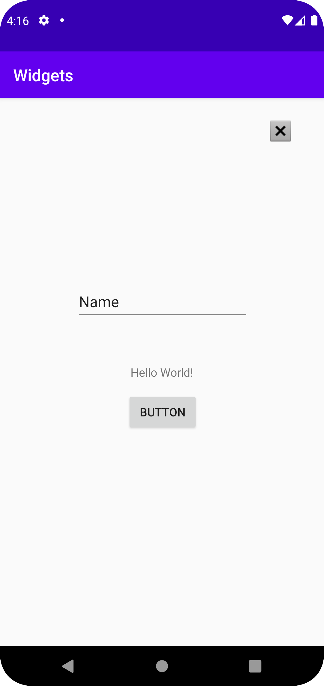

# Rapport

**Skriv din rapport här!**

Started with adding a simple ConstraintLayout which all widgets will be constrained to.
Then three widgets were added to the project. A text box, a button and an image.
The three widgets were then constrained to the layout so they will keep the desired position when the app start.
A fourth widget was added to test how the imageview worked, and there after was also constrained to the layout.

The code below is for the 2nd image that looks like a exit button.
With the code you get more control over the widgets.
You can easily change size, position and more.
This gives you the ability to write code that changes aspect of widgets, you can write a code which increases the size of the text box if the button is pressed.

```
<ImageView
            android:id="@+id/imageView2"
            android:layout_width="wrap_content"
            android:layout_height="wrap_content"
            android:layout_marginStart="332dp"
            android:layout_marginLeft="332dp"
            android:layout_marginTop="57dp"
            android:layout_marginEnd="47dp"
            android:layout_marginRight="47dp"
            android:layout_marginBottom="641dp"
            app:layout_constraintBottom_toBottomOf="parent"
            app:layout_constraintEnd_toEndOf="parent"
            app:layout_constraintStart_toStartOf="parent"
            app:layout_constraintTop_toTopOf="parent"
            app:srcCompat="@android:drawable/btn_dialog" />
```


